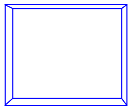
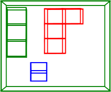
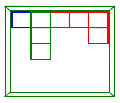
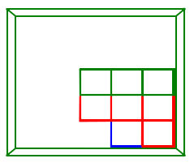

# Implementación de Block Out 2: Proyección 3D

En este proyecto, se ha llevado a cabo la implementación de la parte proyectiva del juego "Block Out 2". A través de una combinación de elementos tridimensionales (3D) y proyecciones en pantalla.

## Figuras Básicas en 3D

Para dar vida al mundo de "Block Out 2", se ha definido un conjunto de al menos 3 figuras básicas en 3D. Este conjunto incluye figuras geométricas variadas, con al menos una cuádrica. A continuación, se describen estas figuras:

### Figura 1: Cubo Tridimensional

La **Figura 1** es un cubo tridimensional (3D) con caras perfectamente cuadradas. Este cubo se utiliza como uno de los elementos clave del juego. Los jugadores deben rotar y ubicar el cubo dentro del cuarto.

A partir del cubo de definen las figura adicionales, una es una recta unida por 3 cubos, la siguiente es una L unida por 4 cubos, esto con e fin de añadirle mas variadades al juego.

## Cuarto en el Mundo Real

Como parte esencial de la experiencia, se ha definido un cuarto en el mundo real. Este cuarto, modelado como un paralelepípedo, tiene medidas reales en metros. Sirve como el espacio tridimensional donde se desarrolla el juego. Las dimensiones físicas del cuarto añaden una capa de realismo a la experiencia de juego.

## Proyección en Pantalla

Una de las hazañas técnicas más destacadas de este proyecto es la proyección del cuarto en una imagen en pantalla. Similar al tablero donde se juega "Block Out", esta proyección en pantalla crea un entorno virtual que replica fielmente las dimensiones y características del cuarto en el mundo real. 

## Ubicación de Figuras en el Cuarto

Dentro del cuarto proyectado, se ha seleccionado una de las figuras básicas definidas en el paso anterior. Esta figura se ubica estratégicamente dentro del cuarto, creando un desafío adicional para el jugador. El objetivo es encajar la figura de manera correcta dentro del espacio tridimensional del cuarto, siguiendo las reglas del juego.

  
  
  

## Estructura de Scripts en el Proyecto "Block Out 2"

El proyecto se compone de cinco scripts fundamentales, cada uno desempeñando un papel crucial en la implementación y funcionalidad del juego. 

### 1. `main_test.py`: Archivo Principal de Pruebas

- Este script actúa como el archivo principal de pruebas del proyecto. 

### 2. `main.py`: Archivo Principal del Proyecto

- El script principal, denominado "main.py", cumple una función central al recoger e integrar los otros tres scripts esenciales: `figures.py`, `controller.py` y `transformations.py`

### 3. `figures.py`: Implementación de Geometría y Figuras

- El script "figures.py" es responsable de proporcionar la implementación de las figuras geométricas necesarias para el juego. 

### 4. `controller.py`: Control de las Figuras

- El script "controller.py" se encarga del control de las figuras dentro del entorno del juego. 

### 5. `transformations.py`: Implementación de Transformaciones

- El script "transformations.py" contiene la implementación de las transformaciones geométricas necesarias para modificar la posición y orientación de las figuras en el espacio 3D. 

